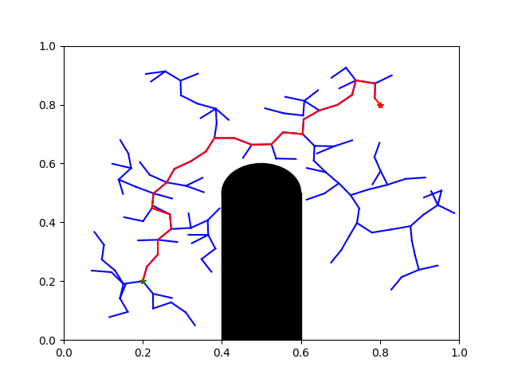

# Path Planning with (Rapidly-exploring Random Trees) RRTs

This project includes an implementation of RRT in 2D world, with which we plan a path from green star to red star and avoid collision with black obstacles. The tree is presented with blue lines and the path is marked in red.

Parameter setting is stored in *planar_rrt.py*.