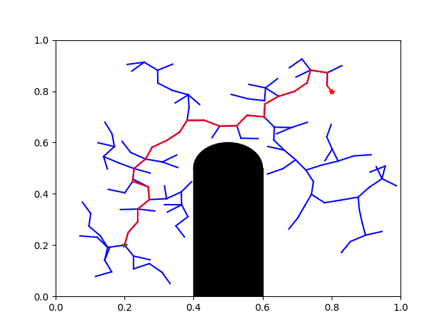
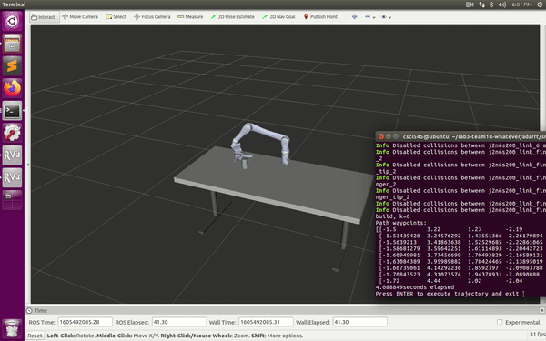

# Path Planning with (Rapidly-exploring Random Trees) RRTs

This project includes 2 parts:

 ### Part 1: *planar_rrt.py*
 An implementation of RRT in 2D world, with which we plan a path from green star to red star and avoid collision with black obstacles. The tree is presented with blue lines and the path is marked in red.

### Part 2: *adarrt.py*
Another instance of RRT in ROS, in which we plan a path to move robot arm to the desired position. In this part we assigned a probability to generate uniform-distribution random samples around the goal. 
